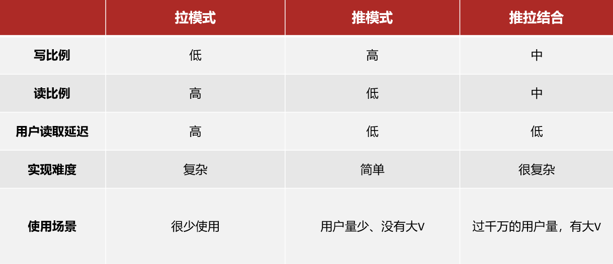

# 好友关注

## 关注和取关

`api/follow/{id}/true`,关注id的用户

`api/follow/{id}/false`,取关id的用户

`api/follow/or/not/{id}`,是否关注了id的用户

用户与用户间的关注关系——多对多关系，引入中间表(`tb_follow`)

关注和取关是`tb_follow`表中当前用户id-被关注用户id的增删

判断当前用户是否关注了某用户是对`tb_follow`表的查

## 共同关注

进入博主首页的查看博主资料(`api/user/{id}`)和查看博主的博客(`api/blog/of/user?id,current`)已实现

`api/follow/common/{id}`当前用户与id的用户的共同关注

将关注的用户信息存放到redis中，类型是set，key是follows:id，value是id，表示一个用户的关注的集合

取两个用户关注的集合，取交集就是共同关注

然后根据交集中所有的id查数据库，得到共同关注用户的信息

## 关注推送

P84——原来不止我反感推荐系统（

关注推送也叫做Feed流，直译为投喂。为用户持续的提供“沉浸式”的体验，通过无限下拉刷新获取新的信息。

传统：用户查找内容
feed模式：内容匹配用户

### feed流

Feed流产品有两种常见模式：

- Timeline：不做内容筛选，简单的按照内容发布时间排序，常用于好友或关注。例如朋友圈
    
    优点：信息全面，不会有缺失。并且实现也相对简单

    缺点：信息噪音较多，用户不一定感兴趣，内容获取效率低

- 智能排序：利用智能算法屏蔽掉违规的、用户不感兴趣的内容。推送用户感兴趣信息来吸引用户
    
    优点：投喂用户感兴趣信息，用户粘度很高，容易沉迷

    缺点：如果算法不精准，可能起到反作用

本例中的个人页面，是基于关注的好友来做Feed流，因此采用Timeline的模式。该模式的实现方案有三种：

- 拉模式：读扩散，用户在读的时候收取信息，省内存
- 推模式：写扩散，信息在写的时候直接推送到粉丝，省时间
- 推拉结合：

    读写混合，普通的人的消息直接推送

    对于大V，活跃粉丝也直接推送，普通粉丝因为数量多所以采用拉模式

对于千万以下的用户量，都可以算少用户

### feed流的滚动分页

使用sortedset，记录时间戳

`api/blog/of/follow`

这次查询的最后时间戳和偏移量不保存在数据库中，是当前查询的分页，第一次查询时offset默认为0，查询完每一页返回给前端，前端再将参数作为下一次请求返回给后端

请求参数：

    lastId: 上一次查询的最小时间戳

    offset: 偏移量

返回值：

    List<Blog>:小于指定时间戳的笔记集合
    
    minTime：本次查询的推送的最小时间戳
    
    offset：偏移量
